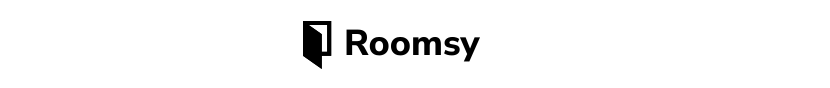

<div id="top" />



<h2 align="center"><a href="https://justinpv98.github.io/roomsy" target="_blank">Click for Live Demo</a></h2>

**Roomsy** is a simple landing page built in React that emulates a booking website such as Airbnb.

### Table of Contents

- [About the Project](#about)
  - [Technologies](#technologies)
  - [Features](#features)
  - [Goals](#goals)
- [Screenshots](#screenshots)
- [Getting Started](#getting_started)
  - [Installation](#installation)
- [Contributing](#contributing)
- [Acknowledgements](#acknowledgements)

<p align="right">(<a href="#top">back to top</a>)</p>

## About the Project <a name="about"></a>

### Technologies <a name="technologies"></a>

[![React][react.js]][react-url] 
[![Sass][sass-lang]][sass-url] 
[![CSS Modules][css-modules]][cssmodules-url]

### Features <a name="features"></a>

- Complex CSS layouts with grid and flex layouts
- Accordions and tabs


### Goals <a name="goals"></a>

- Practice coding out websites from a design.
- Stick as close to the website as possible.

<p align="right">(<a href="#top">back to top</a>)</p>

## Screenshots <a name="screenshots"></a>


<p align="right">(<a href="#top">back to top</a>)</p>

## Getting Started <a name="getting_started"></a>

### Installation <a name="installation"></a>

Clone the repo and install through your method of choice.

```
$ git clone https://github.com/justinpv98/cnema.git
$ cd roomsy
$ npm install
```

Run a development server.

```
npm start
```

<p align="right">(<a href="#top">back to top</a>)</p>

## Contributing <a name="contributing"></a>

Contributions, issues and feature requests are welcome.
<p align="right">(<a href="#top">back to top</a>)</p>

## Acknowledgements <a name="acknowledgements"></a>

[This Behance profile][behance] for the original design.

<p align="right">(<a href="#top">back to top</a>)</p>


<!-- LINKS -->

[behance]: https://www.behance.net/gallery/119830395/Roomsy
[react.js]: https://img.shields.io/badge/react-20232A?style=for-the-badge&logo=react&logoColor=61DAFB
[react-url]: https://reactjs.org/
[sass-lang]: https://img.shields.io/badge/sass-CC6699?style=for-the-badge&logo=sass&logoColor=white
[sass-url]: https://sass-lang.com/
[css-modules]: https://img.shields.io/badge/css_modules-black?style=for-the-badge&logo=cssmodules&logoColor=white
[cssmodules-url]: https://github.com/css-modules/css-modules
[jest-js]: https://img.shields.io/badge/jest-C21325?style=for-the-badge&logo=jest&logoColor=white
[jest-url]: https://jestjs.io/